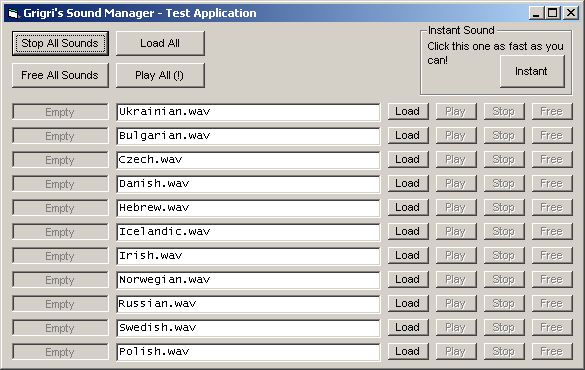



## Play multiple sounds at the same time \(no DLL, no DirectX\)

### Description

Playing multiple sounds simultaneously is not an easy task, especially in VB.

Most VB applications (and games!) that use sound use the PlaySound()

API function [which only allows one sound at a time]; others resort to DirectX

or third-party DLLs such as BASS. This project is a first step to ending all

that, presenting an API-only method.

----

I don't know if it's compatible with VB5, any feedback on this would be appreciated.

----

Includes an extensive ReadMe file, full demo and clean, commented code.
 
### More Info
 

             |
---                |---
**Submitted On**   |2006-10-22 19:05:08
**By**             |[grigri](https://github.com/Planet-Source-Code/PSCIndex/blob/master/ByAuthor/grigri.md)
**Level**          |Advanced
**User Rating**    |5.0 (50 globes from 10 users)
**Compatibility**  |VB 6\.0
**Category**       |[Sound/MP3](https://github.com/Planet-Source-Code/PSCIndex/blob/master/ByCategory/sound-mp3__1-45.md)
**World**          |[Visual Basic](https://github.com/Planet-Source-Code/PSCIndex/blob/master/ByWorld/visual-basic.md)
**Archive File**   |[Play\_multi20264710232006\.zip](https://github.com/Planet-Source-Code/grigri-play-multiple-sounds-at-the-same-time-no-dll-no-directx__1-66856/archive/master.zip)

